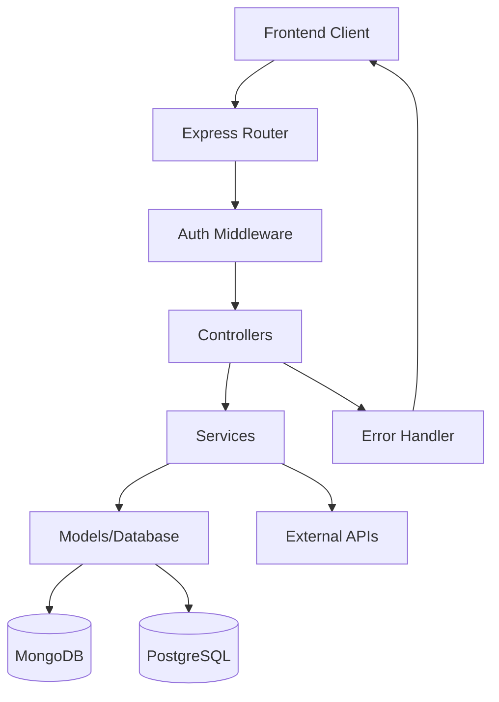

# Design Document

## Overview

The Portfolio Backend API is a RESTful web service built with Node.js and Express.js that provides comprehensive portfolio management capabilities. The system follows a layered architecture pattern with clear separation of concerns, implementing the MVC (Model-View-Controller) pattern with an additional service layer for business logic.

The API supports JWT-based authentication, comprehensive CRUD operations for portfolio entities, dashboard analytics, and includes proper error handling and API documentation through Swagger/OpenAPI.

## Architecture

### High-Level Architecture



### Directory Structure

```
src/
├── controllers/          # Request handlers
│   ├── authController.js
│   ├── profileController.js
│   ├── aboutController.js
│   ├── projectController.js
│   ├── postController.js
│   ├── skillController.js
│   ├── certificateController.js
│   └── dashboardController.js
├── services/            # Business logic
│   ├── authService.js
│   ├── profileService.js
│   ├── aboutService.js
│   ├── projectService.js
│   ├── postService.js
│   ├── skillService.js
│   ├── certificateService.js
│   └── dashboardService.js
├── models/              # Data models
│   ├── User.js
│   ├── Profile.js
│   ├── About.js
│   ├── Project.js
│   ├── Post.js
│   ├── Skill.js
│   └── Certificate.js
├── routes/              # Route definitions
│   ├── auth.js
│   ├── profile.js
│   ├── about.js
│   ├── projects.js
│   ├── posts.js
│   ├── skills.js
│   ├── certificates.js
│   └── dashboard.js
├── middlewares/         # Custom middleware
│   ├── authGuard.js
│   ├── errorHandler.js
│   └── validation.js
├── config/              # Configuration
│   ├── database.js
│   ├── jwt.js
│   └── swagger.js
├── utils/               # Utility functions
│   ├── seedData.js
│   └── helpers.js
├── app.js              # Express app setup
└── server.js           # Server entry point
```

## Components and Interfaces

### Authentication System

**JWT Authentication Flow:**
1. User registers/logs in with credentials
2. Server validates credentials and generates JWT token
3. Client includes JWT token in Authorization header for protected routes
4. AuthGuard middleware validates token and extracts user information

**Components:**
- `authController.js`: Handles registration, login, and user info endpoints
- `authService.js`: Implements authentication business logic
- `authGuard.js`: Middleware for protecting routes
- `User.js`: User model with password hashing

### Data Management Layer

**Service Layer Pattern:**
Each entity (Profile, Projects, Posts, etc.) follows the same pattern:
- Controller receives HTTP requests and delegates to services
- Service contains business logic and data validation
- Model handles database operations and schema definition

**Key Services:**
- `profileService.js`: Manages user profile CRUD operations
- `projectService.js`: Handles project management with file upload support
- `postService.js`: Blog post management with rich content support
- `dashboardService.js`: Aggregates data for analytics and statistics

### API Route Structure

```
/api/auth
├── POST /register
├── POST /login
└── GET /me

/api/profile
├── GET /:user_id
└── PUT /:user_id

/api/about
├── GET /
└── PUT /

/api/projects
├── GET /
├── GET /:id
├── POST /
├── PUT /:id
└── DELETE /:id

/api/posts
├── GET /
├── GET /:id
├── POST /
├── PUT /:id
└── DELETE /:id

/api/skills
├── GET /
├── POST /
└── DELETE /:id

/api/certificates
├── GET /
├── POST /
└── DELETE /:id

/api/dashboard
├── GET /
├── GET /weekly-views
└── GET /projects-timeline
```

## Data Models

### User Model (PostgreSQL)
```sql
CREATE TABLE users (
  id UUID PRIMARY KEY DEFAULT gen_random_uuid(),
  email VARCHAR(255) UNIQUE NOT NULL,
  password VARCHAR(255) NOT NULL,
  role VARCHAR(50) DEFAULT 'user',
  created_at TIMESTAMP DEFAULT CURRENT_TIMESTAMP,
  updated_at TIMESTAMP DEFAULT CURRENT_TIMESTAMP
);
```

### Profile Model (PostgreSQL)
```sql
CREATE TABLE profiles (
  id UUID PRIMARY KEY DEFAULT gen_random_uuid(),
  user_id UUID REFERENCES users(id) ON DELETE CASCADE,
  name VARCHAR(255) NOT NULL,
  avatar TEXT,
  bio TEXT,
  contact JSONB,
  social_links JSONB,
  created_at TIMESTAMP DEFAULT CURRENT_TIMESTAMP,
  updated_at TIMESTAMP DEFAULT CURRENT_TIMESTAMP
);
```

### Project Model (PostgreSQL)
```sql
CREATE TABLE projects (
  id UUID PRIMARY KEY DEFAULT gen_random_uuid(),
  user_id UUID REFERENCES users(id) ON DELETE CASCADE,
  title VARCHAR(255) NOT NULL,
  description TEXT NOT NULL,
  tags JSONB,
  thumbnail TEXT,
  link TEXT,
  status VARCHAR(50) DEFAULT 'active' CHECK (status IN ('active', 'completed', 'archived')),
  created_at TIMESTAMP DEFAULT CURRENT_TIMESTAMP,
  updated_at TIMESTAMP DEFAULT CURRENT_TIMESTAMP
);
```

### Post Model (PostgreSQL)
```sql
CREATE TABLE posts (
  id UUID PRIMARY KEY DEFAULT gen_random_uuid(),
  user_id UUID REFERENCES users(id) ON DELETE CASCADE,
  title VARCHAR(255) NOT NULL,
  content TEXT NOT NULL,
  cover_image TEXT,
  published_at TIMESTAMP,
  tags JSONB,
  status VARCHAR(50) DEFAULT 'draft' CHECK (status IN ('draft', 'published')),
  views INTEGER DEFAULT 0,
  created_at TIMESTAMP DEFAULT CURRENT_TIMESTAMP,
  updated_at TIMESTAMP DEFAULT CURRENT_TIMESTAMP
);
```

### Skill Model (PostgreSQL)
```sql
CREATE TABLE skills (
  id UUID PRIMARY KEY DEFAULT gen_random_uuid(),
  user_id UUID REFERENCES users(id) ON DELETE CASCADE,
  name VARCHAR(255) NOT NULL,
  level INTEGER CHECK (level >= 1 AND level <= 100),
  icon TEXT,
  category VARCHAR(100),
  created_at TIMESTAMP DEFAULT CURRENT_TIMESTAMP
);
```

### Certificate Model (PostgreSQL)
```sql
CREATE TABLE certificates (
  id UUID PRIMARY KEY DEFAULT gen_random_uuid(),
  user_id UUID REFERENCES users(id) ON DELETE CASCADE,
  title VARCHAR(255) NOT NULL,
  issuer VARCHAR(255) NOT NULL,
  issue_date DATE NOT NULL,
  credential_url TEXT,
  icon TEXT,
  created_at TIMESTAMP DEFAULT CURRENT_TIMESTAMP
);
```

### About Model (PostgreSQL)
```sql
CREATE TABLE about (
  id UUID PRIMARY KEY DEFAULT gen_random_uuid(),
  user_id UUID REFERENCES users(id) ON DELETE CASCADE,
  introduction TEXT NOT NULL,
  highlights JSONB,
  image TEXT,
  created_at TIMESTAMP DEFAULT CURRENT_TIMESTAMP,
  updated_at TIMESTAMP DEFAULT CURRENT_TIMESTAMP
);
```

## Error Handling

### Error Handler Middleware
Centralized error handling that:
- Catches all unhandled errors
- Formats consistent error responses
- Logs errors for debugging
- Returns appropriate HTTP status codes

### Error Response Format
```javascript
{
  success: false,
  error: {
    message: "Error description",
    code: "ERROR_CODE",
    details: {} // Additional error details if applicable
  }
}
```

### Common Error Types
- `ValidationError`: Input validation failures (400)
- `AuthenticationError`: Invalid credentials or tokens (401)
- `AuthorizationError`: Insufficient permissions (403)
- `NotFoundError`: Resource not found (404)
- `ConflictError`: Duplicate resource creation (409)
- `ServerError`: Internal server errors (500)

## Testing Strategy

### Unit Testing
- Test individual functions in services and utilities
- Mock database operations and external dependencies
- Use Jest as the testing framework
- Aim for 80%+ code coverage on business logic

### Integration Testing
- Test complete API endpoints with real database
- Use test database for isolation
- Test authentication flows and middleware
- Validate request/response formats

### API Testing
- Use Supertest for HTTP endpoint testing
- Test all CRUD operations for each entity
- Validate error handling and edge cases
- Test authentication and authorization flows

### Test Data Management
- Use faker.js for generating realistic test data
- Implement database seeding for consistent test environments
- Clean up test data after each test suite

## Database Design

### PostgreSQL Implementation
- Use Sequelize ORM for relational data modeling and migrations
- Implement proper foreign key relationships and constraints
- Use SQL queries and Sequelize aggregations for complex analytics
- Leverage PostgreSQL's JSONB support for flexible fields (tags, socialLinks, highlights)
- Implement database migrations for schema versioning
- Use UUID for primary keys for better distributed system support

### Performance Considerations
- Index frequently queried fields (user_id, created_at, status)
- Create GIN indexes for JSONB fields (tags, social_links)
- Implement pagination using LIMIT/OFFSET with proper ordering
- Use database-level aggregation and window functions for statistics
- Configure connection pooling for better performance
- Consider partial indexes for filtered queries

## Security Considerations

### Authentication & Authorization
- JWT tokens with reasonable expiration times
- Password hashing using bcrypt
- Rate limiting on authentication endpoints
- Input validation and sanitization

### Data Protection
- Validate all input data
- Sanitize user-generated content
- Implement CORS properly
- Use HTTPS in production
- Environment variable protection for secrets

### API Security
- Implement request rate limiting
- Add security headers (helmet.js)
- Validate file uploads if implemented
- Protect against common vulnerabilities (XSS, injection)

## API Documentation

### Swagger/OpenAPI Integration
- Generate comprehensive API documentation
- Include request/response schemas
- Document authentication requirements
- Provide example requests and responses
- Interactive API testing interface

### Documentation Structure
- Endpoint descriptions and parameters
- Authentication requirements
- Error response formats
- Data model schemas
- Usage examples and best practices